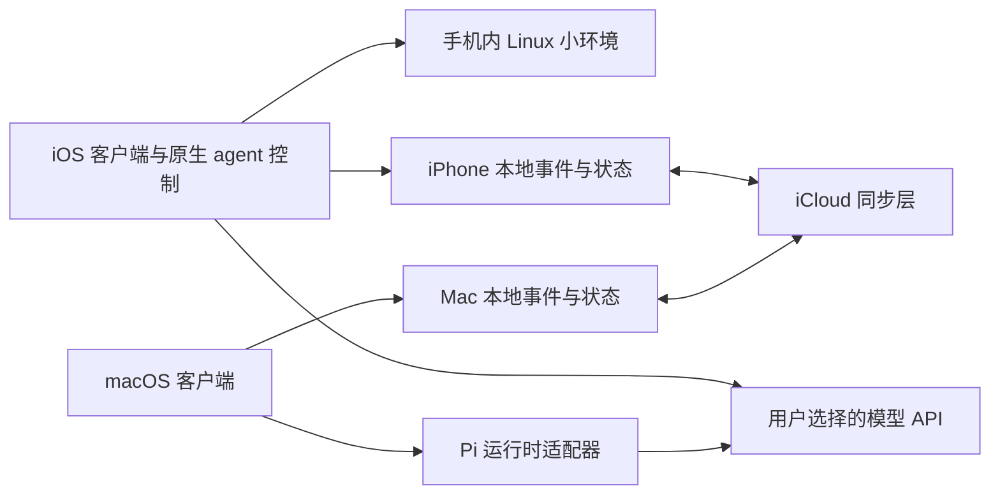

# 技术方案 v0.1

日期：2026-10-09。状态：候选方案；未开工。当前约束是无自建执行服务器、手机独立、iCloud 同步、macOS 基于 Pi。

## 推荐的系统形态

一个逻辑身份，多设备各自运行。同步的是身份、对话、目标、记忆、内容和进度；不是把某台设备的全部模型进程复制到另一台设备。没有可运行设备时不声称还有常在线 agent。

## iOS：两条候选路线

| 路线 | 价值 | 成本或限制 | 建议 |
|---|---|---|---|
| 基于 OpenMinis iOS 能力层分支 | Swift/SwiftUI、iSH 小环境、原生工具与现成保活可研究 | GPL 组件和构建链较重；需要明确隔离产品 UI 与上游更新 | 优先评估可复用范围 |
| 独立原生客户端与小环境集成 | 更自由的 Muse 式体验和长期维护边界 | 重做环境、工具协议和恢复；集成成本更高 | 若上游耦合过重再选择 |

Lody 的 RN + Swift 技术有价值，但当前需求是手机本身执行。不能只复用其远端客户端就宣称手机具备 agent。建议借鉴 UIKit 虚拟化消息列表、原生输入与键盘处理、流式文字、系统展示和本地显示缓存；是否采用 RN 壳还是 SwiftUI 壳需看小环境的集成成本。不开工前不锁死框架。

**建议默认**：iOS agent 控制逻辑在原生宿主内执行；Linux 环境承担文件、脚本与辅助工具。不要假设 Pi 的 Node 依赖能在 iSH 中高效稳定运行。Pi 在手机里运行作为可行性备选，而非首版承诺。

iOS 工具必须遵守系统可访问范围；小环境不获得其他 App 的私有数据。邮件、Notion 等通过接口或用户导入；Obsidian 用用户选定文件访问。账户 Keychain、网络工具、审批和小环境之间需明确边界。

## macOS：Pi 为执行底座

源码当前指向 earendil-works/pi。候选是 SDK 包装或独立 Pi 子进程，封装成项目自己的 RuntimeAdapter。Pi 负责模型回合、工具事件和会话能力；产品负责目标、记忆、推荐、计划调整、同步和执行记录。

pi-durable 当前标记 Experimental，不把它作为已稳定的恢复基础。评估后选择固定版本与恢复路径；项目的产品状态格式不依赖某个上游会话私有结构。首版只暴露明确批准的工具，不直接给整个 Mac 无限制 shell 权限。

macOS 壳候选为原生 SwiftUI/AppKit + Pi 子进程，或 Electron + Pi 服务；前者偏原生体验，后者对接 TypeScript 较快。建议先用原生方案作比较基准，最终由分发方式、资源占用和开发成本决定。

## 数据与 iCloud

建议每台设备在本地 SQLite 维护可重建视图，同步稳定 ID 的记录或不可变事件。结构化同步优先评估 CloudKit 私有数据库，附件可考虑 iCloud Drive；具体路线未确定。不要直接让两台设备同时修改同一个放在 iCloud Drive 的活跃 SQLite 数据库。

记录包含 schemaVersion、eventId、deviceId、时间、来源和版本关系。冲突保留双方资料，用户明确纠正优先，删除传播包含 tombstone。设备时间不可靠时不只靠时间戳判输赢。

**同步不等于任务锁**：iCloud 可能延迟或离线，两台设备可能同时运行。首版建议同一目标或周期任务指定执行设备；换设备前显示待接管状态。对邮件发送、支付、删除等不可幂等动作先不做自动跨设备接管。仅依赖 iCloud 不能保证全局 exactly-once。

后续验证离线合并、重复回放、乱序、删除传播、附件尚未下载、存储不足、退出 iCloud 与迁移。API key 默认不随普通记忆文件同步；是否使用同步 Keychain 由用户选择。必须区分本地存储、同步到 Apple 与发给模型供应商三条数据路径。

## 记忆和画像

原始材料、结构化事实、短期状态、检索索引分开。给每条事实保留 sourceId 和可信类型；更新原事实产生新版本；索引可以重建。用户画像是可解释的当前视图，不是无限膨胀的系统提示词。

跨设备采用相同记忆和目标协议，两个平台的 agent 实现可以不同。模型切换只改变推理服务，不替换人格设置和用户历史。

## 信息来源与推荐

导入 → 提取候选 → 来源与主体识别 → 去重/更新 → 记忆视图 → 目标与点子 → 内容选择。连接器先只读；登录和刷新通过原生安全存储处理。语言模型判断相关性，确定性规则负责范围、去重、频率、成本和撤销。

兴趣动态可用用户选择的 RSS、公开检索和获准来源。搜索与供应商地址配置可替换，首版不能硬依赖仅境外可达的基础服务。中国直连需在关闭代理的实际网络上验收；现有调研并未完成这项测试。

## 开源选择

源码证据：OpenMinis 是 GPL；nanoMuse 当前声明 GPL-3.0-or-later；Lody iOS 是 AGPL-3.0-only；Pi 是 MIT。若直接复用对应代码，需评估对应组件和整体分发要求。当前仓库只含原创文档，以 MIT 发布；应用许可证待复用方案确定后再定。本文是工程取舍记录，不替代具体分发审查。

## 未解决的关键风险

手机锁屏长期执行、小环境构建和耗电、iCloud 延迟导致重复任务、两个 agent 的行为一致性、导入后记忆污染、连接器可达性、上游迭代维护和 App 分发。第一轮技术验证必须围绕这些风险，而不是先铺完整 UI。
